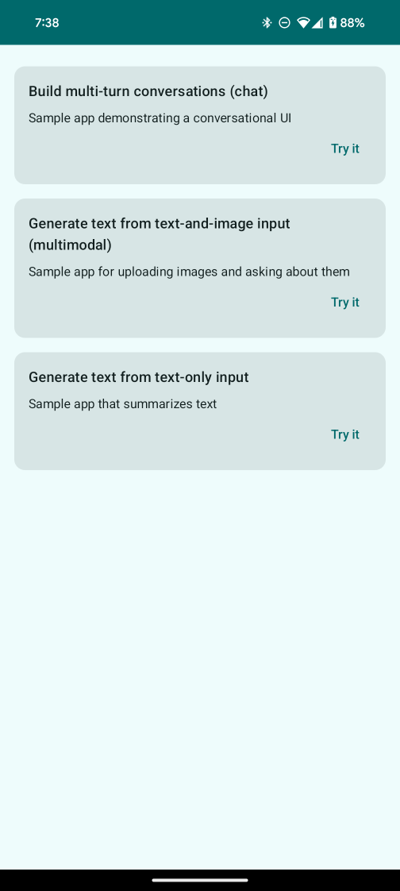

# Android AI app

## Read the blog with steps to generate the google-services.json file
[Medium blog post](https://andresand.medium.com/configuring-firebase-vertex-ai-in-your-android-app-748416599eee)

**Note: for the code to work you need a Firebase account and configure your google-services.json
file. Ensure it's at the root level of your app module ```app/google-services.json```**

1. After registering your app, Firebase will generate the google-services.json file.
2. Click the button Download google-services.json.
3. In your Android Studio project, move the downloaded file google-services.json into the app module
   directory.

# Demo App



### Google Cloud - Gemini Logs Explorer

[Dashboard](https://console.cloud.google.com/active-assist/dashboard?invt=AbtR4A&project=code-ai-444fd)
[Logs](https://console.cloud.google.com/logs/query;query=resource.type%3D%22project%22;cursorTimestamp=2025-03-28T23:16:56.841353Z;duration=P2D?invt=AbtR2w&project=code-ai-444fd)

### Gemini docs

[API](https://ai.google.dev/gemini-api/docs/quickstart?lang=rest)

### References

[Using Google's demo app](https://github.com/google-gemini/deprecated-generative-ai-android/blob/main/generativeai-android-sample/app/src/main/kotlin/com/google/ai/sample/MainActivity.kt)
